---
## Front matter
title: "Отчёт по лабораторной работе"
subtitle: "Дисциплина: Основы информационной безопасности"
author: "Безрук Мария Андреевна"

## Generic otions
lang: ru-RU
toc-title: "Содержание"

## Bibliography
bibliography: bib/cite.bib
csl: pandoc/csl/gost-r-7-0-5-2008-numeric.csl

## Pdf output format
toc: true # Table of contents
toc-depth: 2
lof: true # List of figures
lot: true # List of tables
fontsize: 12pt
linestretch: 1.5
papersize: a4
documentclass: scrreprt
## I18n polyglossia
polyglossia-lang:
  name: russian
  options:
	- spelling=modern
	- babelshorthands=true
polyglossia-otherlangs:
  name: english
## I18n babel
babel-lang: russian
babel-otherlangs: english
## Fonts
mainfont: PT Serif
romanfont: PT Serif
sansfont: PT Sans
monofont: PT Mono
mainfontoptions: Ligatures=TeX
romanfontoptions: Ligatures=TeX
sansfontoptions: Ligatures=TeX,Scale=MatchLowercase
monofontoptions: Scale=MatchLowercase,Scale=0.9
## Biblatex
biblatex: true
biblio-style: "gost-numeric"
biblatexoptions:
  - parentracker=true
  - backend=biber
  - hyperref=auto
  - language=auto
  - autolang=other*
  - citestyle=gost-numeric
## Pandoc-crossref LaTeX customization
figureTitle: "Рис."
tableTitle: "Таблица"
listingTitle: "Листинг"
lofTitle: "Список иллюстраций"
lotTitle: "Список таблиц"
lolTitle: "Листинги"
## Misc options
indent: true
header-includes:
  - \usepackage{indentfirst}
  - \usepackage{float} # keep figures where there are in the text
  - \floatplacement{figure}{H} # keep figures where there are in the text
---

# Цель работы

Научиться создавать виртуальную машину и устанавливать на нее OC Linux, а так же настроить
необходимые для дальнейшей работы сервисы.

# Выполнение лабораторной работы

## Создание виртуальной машины и выбор ОС

Создадим виртуальную машину, используя программу Oracle VM VirtualBox. В начале устанавливаем расопложение виртуальной машины и выбираем тип (рис. [-@fig:001])

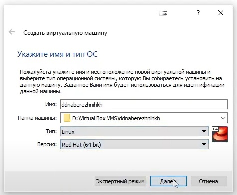{ #fig:001 width=70% }

Зададим необходимое количество оперативной памяти - пусть это будет 12288 МБ (12 ГБ) (рис. [-@fig:002])

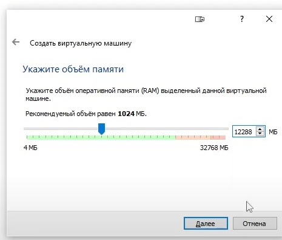{ #fig:002 width=70% }

Создадим новый виртуальный жесткий диск (рис. [-@fig:003])

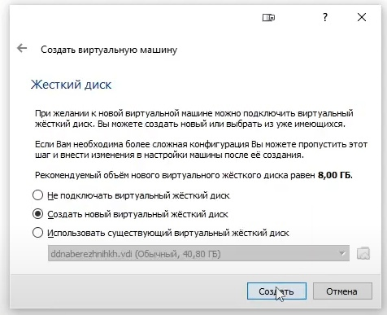{ #fig:003 width=70% }

Выбираем VDI как тип жесткого диска (рис. [-@fig:004])

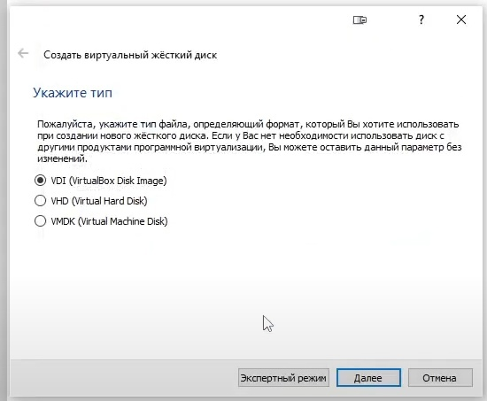{ #fig:004 width=70% }

Указываем формат хранения - динамический жесткий диск (рис. [-@fig:005])

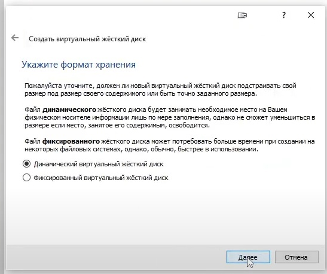{ #fig:005 width=70% }

Выбираем объем жесткого диска - 40 ГБ (рис. [-@fig:006])

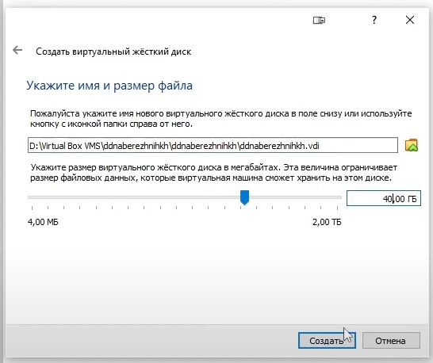{ #fig:006 width=70% }

Переходим в окно настроек виртуальной машины и в разделе "Носители" выбираем оптический диск (рис. [-@fig:007])

{ #fig:007 width=70% }

Запускаем виртуальную машину (рис. [-@fig:008])

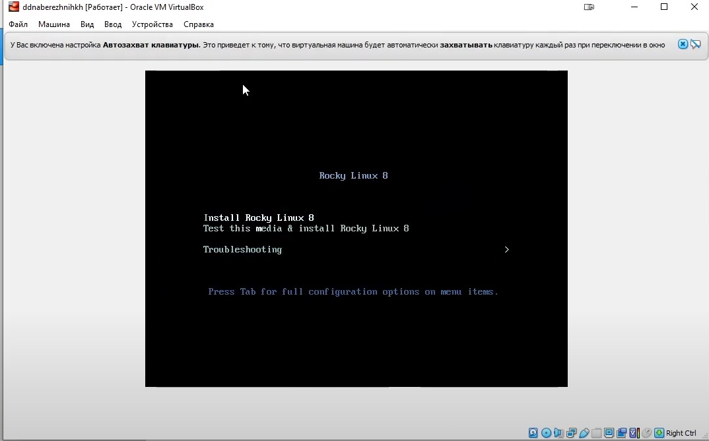{ #fig:008 width=70% }

Выбираем язык, я оставила английский (рис. [-@fig:009])

{ #fig:009 width=70% }

Отключаем KDUMP (рис. [-@fig:010])

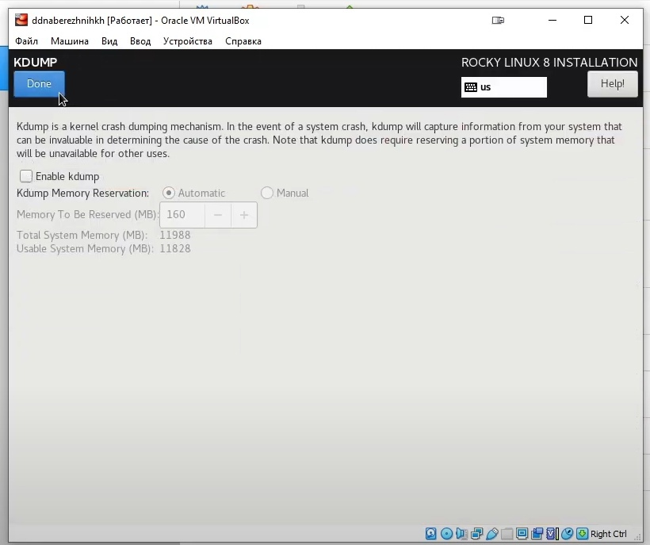{ #fig:010 width=70% }

Подключаем сетевое соединение (рис. [-@fig:011])

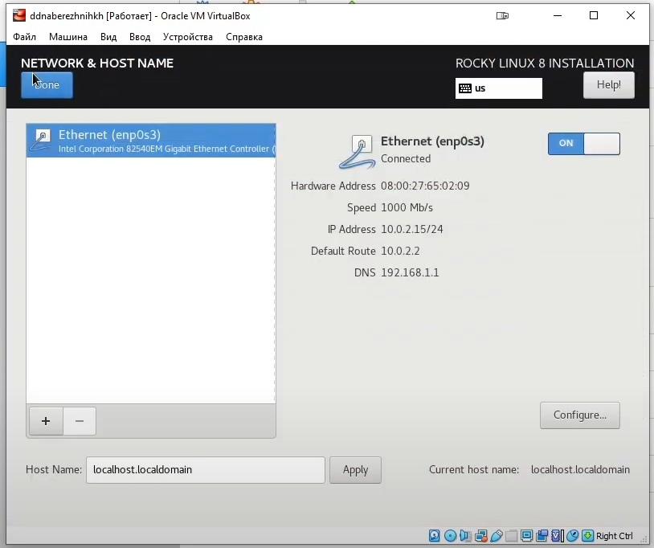{ #fig:011 width=70% }

Устанавливаем пароль для root и администратора (рис. [-@fig:012])

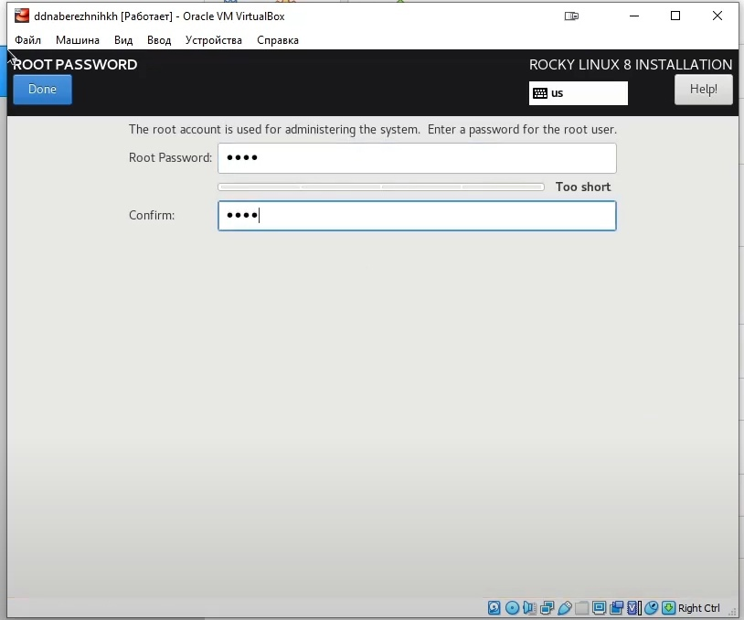{ #fig:012 width=70% }

Создаем пользователя с правами администратора (рис. [-@fig:013])

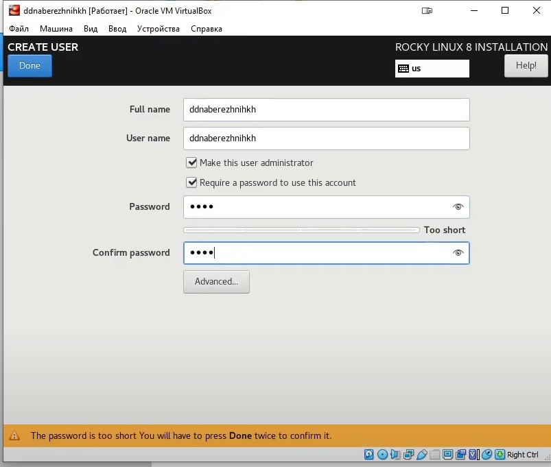{ #fig:013 width=70% }

Запускаем установку ОС, после завершения установки перезапускаем систему и принимаем условия лицензии (рис. [-@fig:014])

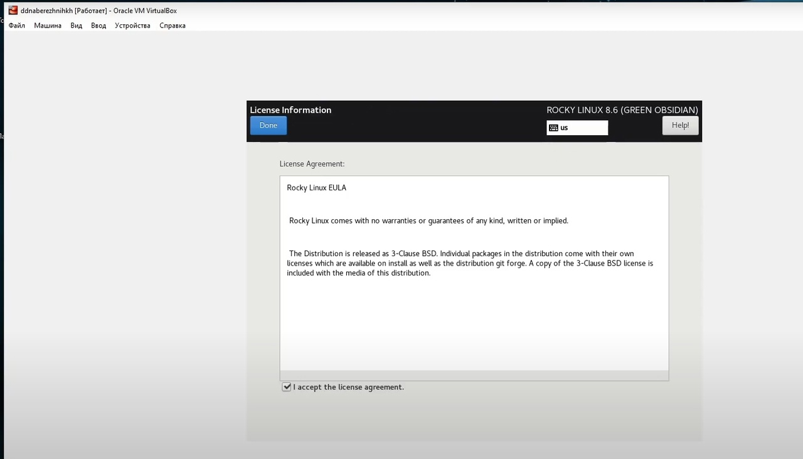{ #fig:014 width=70% }

Открываем консоль и устанавливаем имя хоста (рис. [-@fig:015])

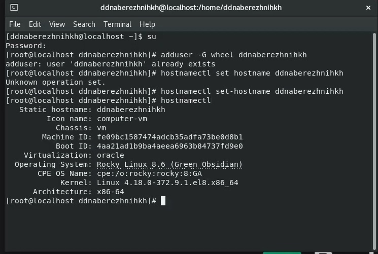{ #fig:015 width=70% }

## Домашнее задание

С помощью команды dsmeg узнала данные системы (рис. [-@fig:016])

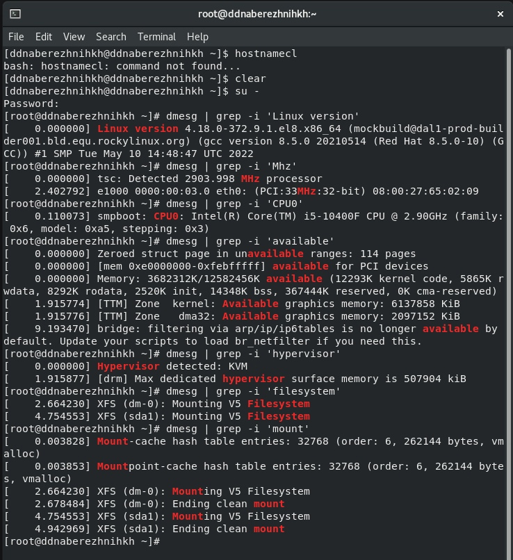{ #fig:016 width=70% }

1. Версия ядра --- 4.18.0-372.9.1.еl18.x86_63
1. Частота процессора --- 2903.998
1. Модель процессора --- Intel(R) Core(TM) i5-10400F 
1. Объем оперативной памяти --- 3682312 Кбайт
1. Тип обнаруживаемого гипервизора --- KVM
1. Тип файловой системы --- XFS
1. Последовательность монтирования файловых систем можно найти через dmesg | grep -i 'mount'

# Выводы

Познакомилась с процессом создания виртуальной машины, а так же установила на нее ОС Linux, после этого настроила для дальнейшей работы 

# Контрольные вопросы

1. Когда пользователь регистрируется в системе (проходит процедуру авторизации, например, вводя системное имя и пароль), он идентифицируется с учётной записью, в которой система хранит информацию о каждом пользователе: его системное имя и некоторые другие сведения, необходимые для работы с ним. 
1. Команды терминала:
	1. Команда man для получения справки по команде
	1. Команда cd используется для перемещения по файловой системе
	1. Команда ls используется для просмотра содержимого каталога.
	1. Команда du отображает объем дисковой памяти (в килобайтах), занятой указанными файлами или каталогами.
	1. Команда mkdir используется для создания каталогов.
	1. Команда rm используется для удаления файлов и/или каталогов.
	1. Команда chmod (change mode – сменить режим) предназначена для изменения прав доступа к файлам и каталогам.
	1. Для вывода на экран списка ранее выполненных команд используется команда history. 
1. Файловая система - часть операционной системы, которая обеспечивает чтение и запись файлов на дисковых носителях информации. Файловая система устанавливает физическую и логическую структуру файлов, правила их создания и управления ими, а также сопутствующие данные файла и идентификацию. Каждый дистрибутив Linux позволяет использовать одну из этих файловых систем:
	1. Ext2;
	1. Ext3;
	1. Ext4;
	1. JFS;
	1. ReiserFS;
	1. XFS;
	1. Btrfs;
	1. ZFS;
Все они включены в ядро и могут использоваться в качестве корневой файловой
системы.
1. С помощью findmnt. Можно переключиться из представления дерева по
умолчанию в представление списка с помощью -l, определить выходные столбцы с помощью –o, отфильтровать результаты по типу файловой системы с помощью и –t.
Эта команда используется для поиска монтированных устройств, а также может монтировать или размонтировать их при необходимости.
Для просмотра всех примонтированных файловых систем использовать команду:
findmnt —all
1. Найдем процесс:
ps -A | grep "имя_процесса"
Для завершения процесса нужно вызвать утилиту kill с параметром "-9". В этом случае она просто убьет процесс без процедуры "завершитесь, пожалуйста" (123 - ID процесса).
sudo kill -9 123
Также можно использовать утилиту killall, когда необходимо убить дерево процессов.
sudo killall имя_процесса

