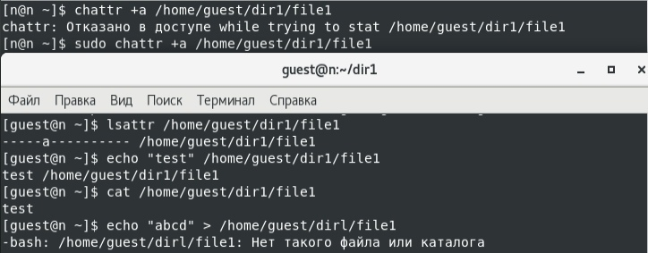
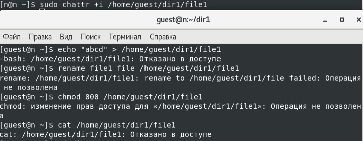

---
## Front matter
title: "Лабораторной работа №4"
author: "Безрук Мария Андреевна, НПМбд-02-20"

## Generic otions
lang: ru-RU
toc-title: "Содержание"

## Bibliography
bibliography: bib/cite.bib
csl: pandoc/csl/gost-r-7-0-5-2008-numeric.csl

## Pdf output format
toc: true # Table of contents
toc-depth: 2
lof: true # List of figures
fontsize: 12pt
linestretch: 1.5
papersize: a4
documentclass: scrreprt
## I18n polyglossia
polyglossia-lang:
  name: russian
  options:
	- spelling=modern
	- babelshorthands=true
polyglossia-otherlangs:
  name: english
## I18n babel
babel-lang: russian
babel-otherlangs: english
## Fonts
mainfont: PT Serif
romanfont: PT Serif
sansfont: PT Sans
monofont: PT Mono
mainfontoptions: Ligatures=TeX
romanfontoptions: Ligatures=TeX
sansfontoptions: Ligatures=TeX,Scale=MatchLowercase
monofontoptions: Scale=MatchLowercase,Scale=0.9
## Biblatex
biblatex: true
biblio-style: "gost-numeric"
biblatexoptions:
  - parentracker=true
  - backend=biber
  - hyperref=auto
  - language=auto
  - autolang=other*
  - citestyle=gost-numeric
## Pandoc-crossref LaTeX customization
figureTitle: "Рис."
tableTitle: "Таблица"
listingTitle: "Листинг"
lolTitle: "Листинги"
## Misc options
indent: true
header-includes:
  - \usepackage{indentfirst}
  - \usepackage{float} # keep figures where there are in the text
  - \floatplacement{figure}{H} # keep figures where there are in the text
---

# Цель работы

Получение практических навыков работы в консоли с расширенными атрибутами файлов.

# Ход работы

От имени пользователя guest просмотрим расширенные атрибуты файла file1 с помощью команды lsattr. Далее изменим права на этот файл с помощью команды chmod 600 file1, сделав его доступным только для чтения и записи. После этого при попытке добавить расширенный атрибут с помощью команды chattr мы получаем сообщение об ошибке.

{ #fig:001 width=70% }

От имени администратора в другой консоли добавляем файлу file1 аттрибут a командой chattr +a. Убеждаемся в корректном установлении атрибута с помощью команды lsattr. Дозаписываем в конец файла новую информацию с помощью команды echo и проверяем, что это действительно произошло, командой cat. Далее пытаемся стереть информацию в файле с помощью команды echo, на что получаем ошибку. Также не удаётся переименовать файл и изменить его атрибуты командой chmod из-за той же ошибки в правах доступа.

{ #fig:002 width=70% }

Снимаем расширенный атрибут a командой chattr -a от лица администратора. При повторе ранее описанных действий теперь не произошло ошибок и они все выполнились

{ #fig:003 width=70% }

От имени адмистратора добавим файлу расширенный атрибут i и повторим ранее описанные действия. По итогу получаем, что в этом случае файл можно только читать, но нельзя никак изменить.

{ #fig:004 width=70% }

## Выводы

Получила практические навыки работы в консоли с расширенными атрибутами файлов.

# Список литературы

- Медведовский И.Д., Семьянов П.В., Платонов В.В. Атака через Internet. — НПО "Мир и семья-95",  1997. — URL: http://bugtraq.ru/library/books/attack1/index.html
- Медведовский И.Д., Семьянов П.В., Леонов Д.Г.  Атака на Internet. — Издательство ДМК, 1999. — URL: http://bugtraq.ru/library/books/attack/index.html
- Запечников С. В. и др. Информационн~пасность открытых систем. Том 1. — М.: Горячаая линия -Телеком, 2006.
